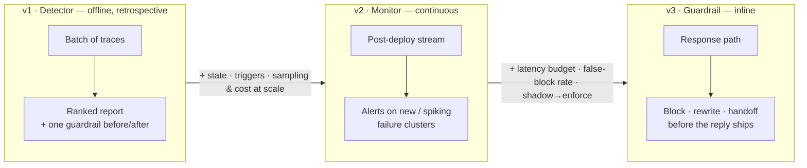
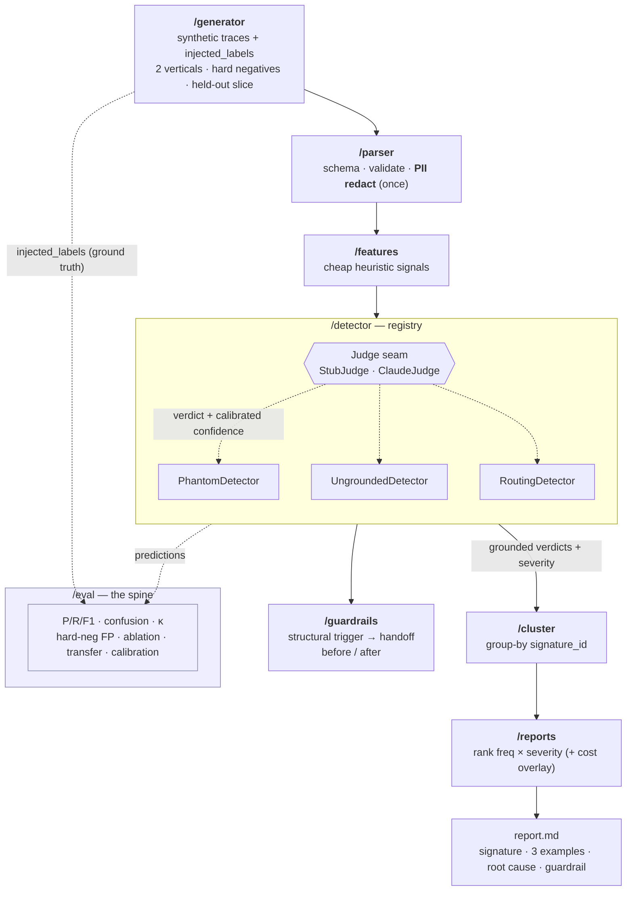

# Architecture

Two views: the **maturity arc** (how the product grows) and the **v1 pipeline** (what gets built first).
Diagrams are Mermaid — GitHub renders them inline.

---

## 1. Maturity arc — detector → monitor → guardrail

The same spine matures from an offline tool into an agent, then into an inline guardrail. Each version
names the *new problem* it must solve.

---

## 2. v1 pipeline — the buildable data flow

A stdlib-only pipeline. Detectors sit behind a common registry and a swappable **Judge seam**
(`StubJudge` for key-free CI, `ClaudeJudge` for the published numbers). Ground truth flows *only* from
the generator into `/eval` — detectors never see it.

**Reading it:**
- **Redact once** at the parser boundary — the judge only ever sees `<txn_id>`-style placeholders.
- **Evidence grounding:** a verdict whose `evidence_span` isn't a verbatim substring of the (redacted) trace is rejected — the verifier verifies itself.
- **Group-by, not clustering:** patterns are grouped by a stable structural `signature_id`, not an ML clustering claim.
- **`/eval` is the spine:** every version keeps it; published numbers come from the `ClaudeJudge` run on the held-out slice, never the stub.

---

## 3. Module responsibilities

| Module | Job | Key contract |
|---|---|---|
| `/generator` | Build labeled, imbalanced synthetic traces (2 verticals) | Emits ground-truth `injected_labels`; hidden from detectors |
| `/parser` | Schema + validators + **PII redaction** | `status` vs `result.success`; `intent_true` vs `intent_routed` |
| `/features` | Cheap heuristic signals | Features, not verdicts |
| `/detector` | Judge-based detectors behind a registry | `Detection{mode, severity, confidence, evidence_span}` |
| `/routing` | Intent→action mismatch | Routing confusion matrix |
| `/cluster` | Group-by structural signature | Stable `signature_id` |
| `/reports` | Rank + render | `freq × severity` (+ optional cost overlay) |
| `/guardrails` | One implemented guardrail + before/after | Detection → mitigation → measured lift |
| `/eval` | **The spine** | P/R/F1 · confusion · κ · hard-neg FP · ablation · transfer · calibration |
