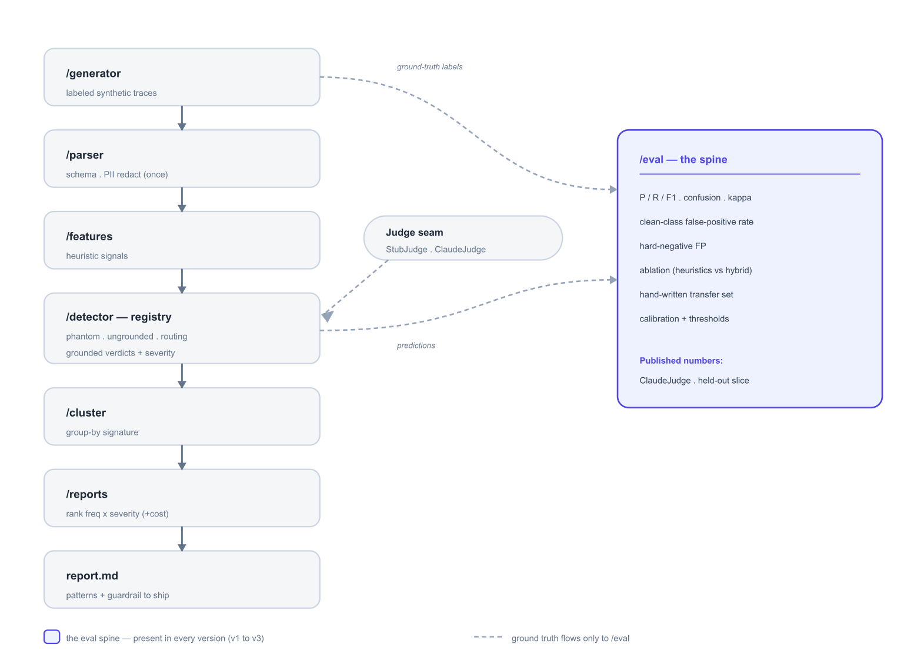

# Silent-Failure Detector

> A silent-failure detection & remediation layer for enterprise CX agents. It mines support-agent
> traces for the *successful-looking* failures — where the conversation looks resolved but a latent
> tool or RAG failure occurred: misrouted intents, phantom actions, masked tool errors, ungrounded
> policy answers — groups them into recurring patterns, ranks them by customer harm, root-causes each
> to a specific tool, and hands the owner **the guardrail to ship first**.

**Reusable agent & framework.** The taxonomy, synthetic generator, detector, eval harness, and guardrail
loop are vendor- and vertical-agnostic — a new domain or platform is a config swap, not a rebuild.
It matures along an arc: an offline **detector** (v1) → a continuous **monitor** (v2) → an inline
**guardrail** (v3). Eval credibility is the centerpiece.

---

## The maturity arc

| Version | Form | What it does | New problem it solves |
|---|---|---|---|
| **v1 — Detector** | Offline, batch, human-in-the-loop | Traces → ranked report of top patterns + one guardrail with a before/after table | Defeating eval circularity; reproducible ranking |
| **v2 — Monitor** | Continuous, post-deploy | Detects *new or spiking* clusters and alerts | Alert dedup/fatigue, drift, and the cost story at 40k+ traces |
| **v3 — Guardrail** | Inline, response-path | Blocks / rewrites / hands off *before* a phantom confirmation ships | Latency budget, false-block rate, shadow → enforce rollout |

---

## Architecture



*The v1 pipeline. Ground truth flows **only** into `/eval` — detectors never see the labels — and the
accent block is the eval spine, present in every version. Published numbers come from the `ClaudeJudge`
run on the held-out slice, never the stub.*

Editable Mermaid source (maturity arc + this pipeline) and the module-responsibility map:
**[ARCHITECTURE.md](ARCHITECTURE.md)**.

---

## The story (why this matters)

Monday morning. The dashboard is green — 88% deflection, CSAT 4.3, 40k weekend conversations. But a
Friday backend deploy quietly changed `file_dispute`'s response shape. The agent now silently fails to
file disputes — and confirms them anyway. ~200 customers were told their dispute was filed. Zero
thumbs-down. Nothing on the dashboard moved.

That's a **silent failure**: the conversation looks successful (fluent answer, ticket "resolved," no
negative signal) while a latent failure occurred underneath. In fintech this isn't a CSAT dip — "we
told 200 customers their dispute was filed and it wasn't" is a regulatory incident. **That severity is
the argument for the project**, and it's why ranking here is customer-centric, not log-centric.

This tool groups those 200 phantom-dispute traces into one pattern, ranks it #1 by
`freq × severity` (with an optional customer-set cost overlay), and hands the owner the signature, three
example traces, a root-cause hypothesis, and the guardrail to ship.

### The failure modes it hunts

- **Misrouted intent** — customer asks to *dispute* a charge; agent routes to *refund lookup* and
  answers confidently about the wrong thing. *(Upstream root cause: a customer routed wrong can never
  be served right downstream.)*
- **Phantom action** — "Your dispute has been filed" when `file_dispute` returned `success:false`.
- **Error masking** — tool returns a 500 → "Your refund is processed."
- **Ungrounded / stale** — quotes a 60-day dispute window when the policy is now 90.

### Vertical-pluggable, fintech-flagship

Same taxonomy, swapped domain:

| Vertical | Illustrative example | Flagship silent failure | Severity |
|---|---|---|---|
| **Fintech / payments** *(flagship)* | a BNPL / payments provider | "Your dispute has been filed" while `file_dispute` returned `success:false` | Critical — regulatory |
| **Subscription / SaaS** | a productivity SaaS (Notion-style) | "Your subscription is canceled" while `cancel_subscription` failed — customer keeps getting billed | High |

---

## Why eval is the whole game

The detector is easy. **A credible eval is the hard part.** The central risk is **circularity**: the
same author writes both the failure injector and the detector, so a naive setup just reverse-engineers
its own templates and reports a meaningless 0.95 F1. The entire design exists to defeat that.

**Four non-negotiable safeguards:**

| Risk | Safeguard |
|---|---|
| **Circularity** | Failure phrasing generated by a **different prompt/model than the judge**, with wide paraphrase variety; a **held-out phrasing set** from templates frozen before detector dev; ~15 **hand-written transfer traces** authored without the generator templates. |
| **Fake precision** | Dataset is realistically **imbalanced (~80% clean)** and seeds **hard negatives** — conversations that look like failures but are fine. |
| **Oversold grouping** | Group by a structured **failure signature**, not prose; framed honestly as a **group-by**, not an ML clustering claim on small n. |
| **Undefined ranking** | Explicit **severity rubric** so `freq × severity` is reproducible, not hand-waved; cost is a customer-configurable overlay, never an invented number. |

**Headline metrics:**

- Per-failure-mode **P / R / F1** + **confusion matrix** — never a single blended number; counts
  reported alongside rates, with confidence caveats at small n.
- The **clean-class false-positive rate** — what an owner actually trusts or distrusts.
- **Intent-routing confusion matrix** — true intent vs. routed action; misrouting recall.
- **Ablation table** — heuristics-only vs. heuristics + LLM judge (the highest-signal artifact; the
  cost/precision tradeoff).
- **Guardrail before/after** — phantom-confirmation rate with the guardrail off vs. on.
- **Transfer result** — P/R/F1 on the hand-written traces; the primary defense against circularity.
- **Eval-the-evaluator** — the LLM judge's own agreement with ground truth; the judge can itself
  hallucinate failures, and that irony is named, not hidden.
- **Confidence calibration** — a reliability curve plus the chosen per-severity thresholds, reported as
  part of the deliverable (the mechanism behind recall-first-Critical / precision-first-Low).
- **Evidence-grounding check** — every accepted verdict's evidence span is a verbatim substring of the
  trace; ungrounded verdicts are rejected, catching the judge's own hallucinations mechanically.

A frozen **regression set** is re-run on every detector change to catch the author's *own* regressions
— the tool that catches agent regressions is itself regression-tested.

---

## How it works

See the [Architecture](#architecture) diagram for the v1 data flow. The same spine is reused across
versions: **v1** runs it offline on a batch; **v2** swaps the generator for a streaming ingest with an
alert store; **v3** wraps the detector as an inline verifier with a latency budget and a shadow→enforce
switch.

- **Heuristics** are a cheap, high-precision pre-filter producing *features, not verdicts*:
  `result.success==false`, `result==null`, retrieval `max_score < τ`, `latency > timeout`, repeated
  user message, intent/tool mismatch.
- **The LLM judge** makes the judgment calls — given the final response, tool results, and retrieved
  chunks: *(1) Does the response claim an outcome the tool results don't support?* (phantom / masking)
  *(2) Is every factual claim grounded in a retrieved chunk?* (ungrounded / stale). Returns
  `{failure_mode, confidence, evidence_span}`. The `confidence` is **calibrated**, with a **per-severity
  operating threshold** (recall-first on Critical, precision-first on Low); the `evidence_span` is
  **verified as a verbatim substring** of the response or a tool result, and ungrounded verdicts are
  rejected — the verifier verifies itself.

The detector earns its keep by reading two things naive monitoring misses: `status:"ok"` alongside
`result.success:false` (the call worked, the *business outcome* failed), and `intent_true ≠
intent_routed` (the customer was answered confidently about the wrong thing).

### Detection ceiling — what it cannot catch yet

- **Strong** where the tool `result` *contradicts* the claim (phantom action, error masking,
  ungrounded-against-retrieved).
- **Weak** where the tool returned `success:true` but the outcome is *semantically wrong* — hallucinated
  args (froze the *wrong* card; disputed the *wrong* txn). A v2+ direction.
- **Out of scope** where there is no tool signal and the claim is a pure world-knowledge hallucination
  unrelated to any retrieved chunk.

### Data governance & PII

Support traces carry PII (txn/account ids, names). PII is **redacted in the parser before any trace
reaches the LLM judge** — the judge sees `<txn_id>` / `<account_id>` placeholders — and since detection
keys off structure (`status` vs. `result.success`), redaction costs no recall. Only redacted signatures
and snippets are stored, with a defined retention window; data residency and processor terms are a named
deployment requirement.

### Guardrails — closing the loop

Detection without "now what" reads junior. Each failure mode maps to a concrete output guardrail:

| Failure mode | Guardrail |
|---|---|
| Phantom action (dispute) | Don't confirm a dispute unless `file_dispute` returns a `dispute_id`. |
| Error masking (refund) | Don't claim "processed" on any non-2xx tool result; surface a handoff. |
| Ungrounded / stale | Don't state a policy figure without a retrieved chunk above score τ; cite it. |
| Misrouting | Re-confirm intent before any state-changing tool call when routing confidence < τ. |

**One is implemented end-to-end** (phantom-action): the affected slice is re-generated with the
guardrail enforced, producing a before/after table — phantom-confirmation rate off vs. on, plus the new
"correctly handed off" rate. **Detection → mitigation → measured improvement.**

### Ranking — severity, with a configurable cost overlay

| Failure mode | Severity | Customer-cost proxy (configurable) |
|---|---|---|
| Phantom financial action (dispute/refund) | Critical (5) | regulatory-exposure events × est. remediation cost |
| Error masking | High (4) | failed transactions × handoff cost |
| Misrouted intent | High (4) | unserved customers × repeat-contact cost |
| Stale / ungrounded policy answer | Medium (3) | misinformed customers × complaint rate |
| Clarification loop | Low (1) | added handle time |

Cost is a **customer-configurable overlay** — the ops leader supplies the $ per remediation. The default
ranking is `freq × severity`, so no dollar figure is invented and the ranking stays defensible.

---

## Repo structure

```
/generator   synthetic trace builder: intents, injectable failures, hard negatives, paraphrase variety
/parser      schema + normalizer + validators
/routing     intent->action mismatch checks + routing eval
/features    heuristic signal extractors (incl. behavioral signals)
/detector    LLM-judge classifiers (phantom_action, ungrounded)
/guardrails  guardrail specs + one implemented guardrail + before/after harness
/cluster     group-by over structured failure signatures
/reports     ranked freq x severity report (+ optional cost overlay; markdown/HTML) w/ annotated traces
/eval        metrics, confusion matrix, ablation, transfer set, regression set
/docs        case study + tradeoffs narrative
README.md
```

---

## Scope — the v1 build

An intent-labeled synthetic dataset with hard negatives · 2 deep detectors (phantom-action +
ungrounded-answer) · 1 lightweight routing-mismatch check · a credible eval · a group-by + ranked
report · a before/after guardrail demo. The repo stays **always demoable** and **eval-first within
every step** — get a real number before adding scope.

### Build order (v1)

1. **Generator + parser** — intents, the 5 tools, injected failures, ~80% clean + hard negatives,
   ~800–1000 traces, held-out phrasing slice. *Done when a validator passes on 100% of traces.*
   **✅ Done**
2. **Phantom-action detector** — heuristic features + LLM judge with evidence spans. **✅ Done**
3. **`/eval` for phantom-action only** — P/R/F1, confusion matrix, hard-negative FP rate.
   *Get one honest number before building anything else.* **✅ Done**
4. **Ungrounded-answer detector + its eval** — same metric treatment. **✅ Done**
5. **Routing-mismatch check + routing eval** — intent→action confusion matrix; misrouting recall. **✅ Done**
6. **Ablation + transfer set** — heuristics vs. hybrid; P/R/F1 on the 15 hand-written traces. **✅ Done**
7. **One guardrail, end-to-end + before/after** — the phantom-action guardrail, measured. **✅ Done**
8. **Group-by + ranked report** — structured-signature grouping; `freq × severity` ranking (+ optional cost overlay). **✅ Done**
9. **Case study + docs** — the Monday-morning story and the learnings. **✅ Done** (see [docs/case-study.md](docs/case-study.md); paste ClaudeJudge block after `python -m eval.published`)

### Published eval (ClaudeJudge, held-out)

From `reports/out/published.md` — Opus `claude-opus-4-8`, n=1000, seed=7:

```
## phantom_action
counts={'tp': 100, 'fp': 0, 'fn': 0, 'tn': 900} rates={'precision': 1.0, 'recall': 1.0, 'f1': 1.0} kappa=1.000 hard_neg_fp=0

## ungrounded
counts={'tp': 50, 'fp': 0, 'fn': 0, 'tn': 950} rates={'precision': 1.0, 'recall': 1.0, 'f1': 1.0} kappa=1.000 hard_neg_fp=0

## misrouting
counts={'tp': 50, 'fp': 0, 'fn': 0, 'tn': 950} rates={'precision': 1.0, 'recall': 1.0, 'f1': 1.0} kappa=1.000 hard_neg_fp=0

## transfer (phantom)
counts={'tp': 4, 'fp': 0, 'fn': 0, 'tn': 11} rates={'precision': 1.0, 'recall': 1.0, 'f1': 1.0}
```

Re-run: `python -m eval.published -n 1000 --model claude-opus-4-8 --out-dir reports/out/stage-final`

### Cut-line (drop from the bottom if behind)

1. Behavioral-feature ablation (transfer-only anyway).
2. Reproducibility claim on grouping → keep it labeled "illustrative."
3. Routing as an LLM check → keep heuristic-only.
4. Annotated-trace screenshots → plain text examples.

**Never cut:** the hard-negative FP rate, the transfer-set result, or the guardrail before/after.
A reviewer who trusts your eval forgives a thin feature set; one who catches an inflated F1 discounts
everything.

---

## Positioning

Generic trace-eval tools (Arize Phoenix, LangSmith, Braintrust) score **individual** traces on generic
metrics. This mines for recurring **systemic** failure patterns tied to a specific intent + tool + root
cause — the prioritization view an owner needs, ending in a concrete guardrail change. It is the
residual-failure layer *on top of* a best-in-class agent platform — a complement, not a competitor.

---

## Learnings / tradeoffs

- **LLM-judge cost/latency vs. heuristic precision** — and how you'd sample or tier at 40k-trace scale.
- **Precision vs. recall** — biased *by severity* (recall-first on Critical, precision-first on Low).
- **Synthetic vs. real-trace gap** — the largest unmitigated risk; named explicitly, partially addressed
  by the hand-written transfer set.
- **Intent routing as upstream root cause** — why a low-frequency misrouting can rank above a
  high-frequency clarification loop once customer harm is priced in.
- **The judge is itself an LLM that can hallucinate failures** — eval-the-evaluator, and own the irony.
